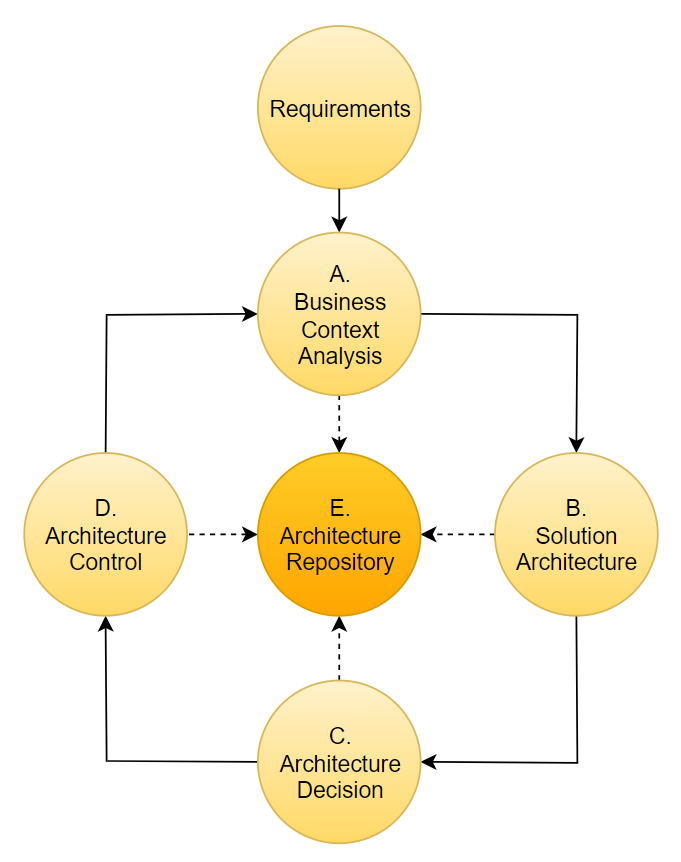

Корпоративная архитектура (КА) на текущий момент так и не стала точной наукой. Скорее это набор лучших практик, направленных на поддержку развития ИТ в организациях.

В данной статье сделана попытка описать "минимально-жизнеспособный" набор практик Корпоративной архитектуры, подходящий для использования в организации любого масштаба. 
Будем называть этот набор **Minimal Architecture Framework (MAF)**. 

При построении минималистичного фрейворка мы будем ориентироваться на процесс принятия технологических решений в организации, обеспечение его прозрачности и сохранение его результатов.

Архитектурная работа связана с разработкой и дальнейшей доработкой артефактов. Поэтому репозиторий архитектурных артефактов является важной частью MAF.
Требования к построению репозитория и возможные варианты его построения также приведены в данной работе. 

## Этапы MAF
Ввиду циклического характера деятельности корпоративного архитектора, будем строить  методологию MAF на основе идеи архитектурного цикла (TOGAF ADM).  
В то же время, состав этапов MAF будет адаптирован к нашему минималистичному подходу.

Рассмотрим типичный процесс деятельности корпоративного архитектора.

Первым этапом процесса корпоративной архитектуры логично является анализ требований во взаимосвязи с существующим бизнес-контекстом.
Требования могут быть определены в различной степени проработки - от подробной постановки до устно сформулированной проблемы. 
Обычно на этом этапе проводится feasibility study - анализ целесообразности реализации. Часть проблем уходит на этом этапе. Что позволяет перезапустить цикл заново. Для Корпоративного архитектора одно-этапный арх.процесс является наиболее предпочтительным.

Если поставленная задача всё же требует действий, то мы переходим к следующему этапу - проработке целевого решения. На уровне Корпоративной архитектуры довольно сложно выделить подуровни - бизнес, приложения, технологии, ценовые параметры, качество работы контрагентов и т.п. На этом же этапе оцениваются требования к миграции, тестированию, внедрению и т.п.
Выделять эти этапы отдельно, как это определено в TOGAF, скорее нецелесообразно. 
Обычно все эти уровни прорабатываются в рамках одного этапа проработки архитектуры целевого решения.
Как правило, имеется несколько наиболее перспективных вариантов построения целевого решения. Архитектор должен проработать все эти варианты.
Целью данного этапа является подготовка принятия решения, что и определяет уровень проработки вариантов целевого решения. 

Следующий логичный этап - выбор варианта реализации и принятие архитектурного решения. Методология данного этапа также может существенно варьироваться - от проведения Архитектурного комитета до оперативного менеджерского решения.
Ключевые требования к данному этапу - прозрачность принятия решения и сохранение результатов, артефактов, логики принятия решения и ответственных за его принятие.

Работа с архитектурными артефактами - параллельный обеспечивающий процесс, обязательный для реализации в рамках MAF. 

Завершающим этапом архитектурного цикла является контроль реализации. сВ зависимости от задачи/организации это может быть как архитектурный говернанс, участие в приёмке, т.п.
Важным моментов является анализ и учет гэпов при реализации задачи по отношению с целевой архитектурой. 
Таким образом, мы подошли к окончанию архитектурного цикла.

Общий вид MAF приведён на схеме:

