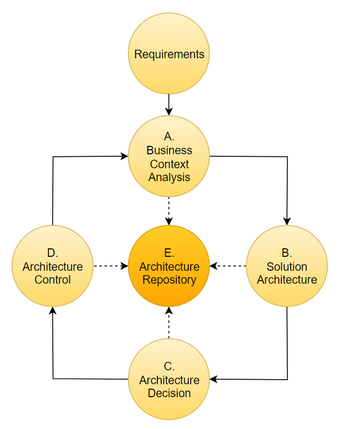
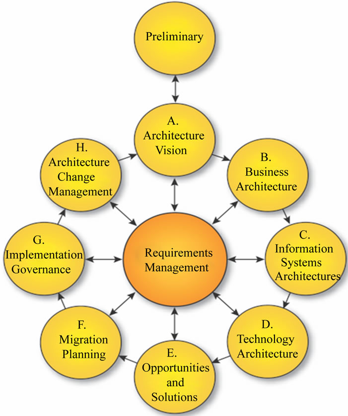

Продемонстрируем разницу подходов на примере архитектурных циклов для MAF:

и для TOGAF:
 

Как видите, в MAF этапов принципиально меньше. А сами этапы имеют более очевидный практический смысл. Давайте рассмотрим каждый из них. 
Т.к. мы строим минимально-жизнеспособный архитектурный процесс, нас будет также интересовать, можно ли обойтись без какого-то из этих этапов.

- Requirements 
  Данный этап вынесен из цикла КА, однако на практике архитектору часто приходится участвовать в разработке требований, или даже писать их самостоятельно.

- A. Business context analysis
  Для Корпоративной архитектуры анализ Бизнес-контекста является обязательным этапом, который нельзя пропустить или отдать на откуп бизнес-аналитикам. Корпоративная архитектура должна максимально учитывать требования Бизнеса - как тактические, так и долговременные стратегические. А качество работы Корпоративного архитектора определяется тем, насколько хорошо он понимает Бизнес и контекст деятельности организации. 

- B. Solution architecture
  Может разрабатываться как корпоративным архитектором, так и проектной командой. Этому этапу как раз уделяется основное внимание в архитектурных методологиях типа TOGAF, поэтому мы не будем подробно останавливаться на нем. Ограничимся лишь базовыми замечаниями. 

- C. Architecture Decision
  Основной и наиболее ответственный этап деятельности КА. Есть разные модели принятия архитектурных решений. Важно, чтобы данный этап был предсказуемый и понятный для всех участников Бизнес.

- D. Architecture Control 
  Архитектурный контроль - также обязательный этап в жизнеспособной Корпоративной архитектуре. Обычно его организация не вызывает серьезных проблем. Архитектурный контроль может встраиваться в уже существующие процессы организации. Например, в процессы приемки и информационного аудита.

- E. Architecture Repository
  Мы рассматриваем Архитектурный репозиторий последним, однако его ведение является общим требованием для всех этапов архитектурной деятельности. 
  Именно по состоянию репозитория пользователи будут судить о состоянии Архитектурной функции в организации. Далее мы подробно рассмотрим данный вопрос.

Таким образом, MVA состоит из четырех последовательных этапов и общего для них процесса разработки/обновления Архитектурного репозитория. 

В заключении отметим, что предлагаемый подход может быть совмещен как с любой архитектурной методологией и, скорее дополняет архитектурные методологии организационно-практическими аспектами их применения.

## А. Анализ бизнес-контекста
### Задачи Корпоративной архитектуры 
При проведении 1й фаза - Анализа бизнес-контекста - требуется держать в голове цели КА. Попробуем сформулировать эти цели.

При общении с представителями Бизнеса можно слышать выражение "technological footprint". Как правило, оно несет в себе негативный контекст - что-то что является нагрузкой (или обузой?) для бизнеса.
Можно сформулировать задачу КА как **снижение технологического следа**.

КА должна обеспечить именно баланс между технологическим разнообразием и унификацией за счет оптимизации "технологического налога" на Бизнес. Архитектурные решения могут быть направлены на отказ от устаревающих технологий и систем, внедрение ИС для задач развивающегося Бизнеса и окружающей бизнес-среды, оптимизация существующей технологической инфраструктуры и т.п.

Таким образом, можно сформулировать две взаимно конкурирующие цели КА:
- Технологическое развитие - соответствие технологической инфраструктуры требованиям развития бизнеса ; 
- Унификация - снижение технологического следа и технологического налога на Бизнес организации.

Архитектурные решения должны обеспечить баланс этих задач в тактическом и стратегическом горизонте.

> MAF рассматривает принятие технологических решений как основную роль КА в организации. Отметим, что данная роль сохранится, независимо от изменения в технологиях и бизнес-процессах, будь то ИИ, размер организации, форма собственности и т.п.

*Некоторые авторы формулируют эту идею как «Архитектура важнее кода». Имея в виду, что с развитием технологий, появлением  фреймворков быстрой разработки, ИИ - сложность и ответственность смещается от разработки  и технологических решений к принятию самих решений - см. например [Rise of Judgement Over Technical Skill](https://notsocommonthoughts.com/blog/ai-and-judgement/)*

Как следствие основных целей, требуется обеспечить выполнение следующих задач:
- организация процесса, вовлечение всех заинтересованных участников, поддержка и фасилитация процесса
- обеспечение прозрачности принятия решений
- история принятия решений с логикой и ответственностью.

### Определение Бизнес-доменов
Для проведения Анализа бизнес-контекста требуется провести его декомпозицию. 
Есть большой набор литературы по теме минимизации связанности и декомпозиции процессов - см DDD в Литературе.

Наиболее простой метод декомпозиции - следование организационной структуре в соответствие с Законом Конвея. 
Если учесть, что основная наша задача - принятие решений в области технологий и бизнеса, то данный подход является наиболее подходящим - значительно облегчит дальнейший процесс принятия решений.

Дальнейший анализ - зависит от глубины понимания архитектором Бизнеса организации.

## B. Архитектурные артефакты

#### Концептуальная архитектура
Наиболее востребованным артефактом Корпоративной архитектуры является Концептуальная архитектура (Solution Architecture) - как для бизнес-пользователей, так и для разработчиков ПО.
  
Совершенно не факт, что Архитектуру решения должен разрабатывать КА. Однако обеспечить наличие и актуальность Концептуальной архитектуры - основная задача КА.

Как минимум, Концептуальная архитектура должна содержать архитектурную диаграмму взаимодействия компонентов с ее описанием.

- Нотация - C4 
  Удобная для архитекторов всех уровней, а также понятная для бизнес-пользователей нотация.
  Удобный инструментарий для разработки диаграмм - Draw.io.
  

- Архитектурные принципы - как правило задаются на уровне Технологической стратегии и не меняются на уровне Концептуальной архитектуры.

- Формат ведения артефактов 
  * текстовые описание – Markdown, Wiki (Confluence и аналогичные)
  * диаграммы - Draw.io, PUML, Mermaid
    – PUML - удобен для архитектора. Довольно удобен и понятен для программистов, в том случае, когда они являются основными потребителями архитектурных диаграмм. Однако, для бизнес-пользователей бывает сложно разобраться в этом формате. Особенно, когда диаграмма становится насыщенной.  

Для хранения архитектурных артефактов используется АРх.репозиторий - эта тема рассматривается далее. 

  - Текстовая БД с картинками
    - Markdown
    - Draw.io, PlantUML, Mermaid

## C. Принятие архитектурных решений / Architecture Decision
Принципиально понимать, что КА - это не рисование картинок, а принятие технологических решений.

> Что мы понимаем под КА:
  - Корпоративная архитектура - это процесс принятия технологических решений.

### ADR / Архитектурные записи
Классический подход ведения ADR - markdown-файлы, хранящиеся в git-репозитории.
Однако, если ваш архитектурный репозиторий хранится в другой системе (Confluence, etc.), то логично вести ADR там же. Отметим, что Confluence имеет специальный шаблон страниц для ведения ADR.

Первый шаг при внедрении ADR - выбор шаблона ведения ваших записей. В сети можно найти много вариантов подобных шаблонов. Начать можно с изучения Githab.com. 
Например, репозиторий [Architecture decision record](https://github.com/joelparkerhenderson/architecture-decision-record) содержит большой набор вариантов и примеров ADR.

Для наших целей подойдет простейший шаблон на основе Markdown, например шаблон [Michael Nygard](https://github.com/joelparkerhenderson/architecture-decision-record/tree/main/locales/en/templates/decision-record-template-by-michael-nygard).

> Title
*Date*

> Status
  *What is the status, such as proposed, accepted, rejected, deprecated, superseded, etc.?*

> Context
  *What is the issue that we're seeing that is motivating this decision or change?*

> Decision
  *What is the change that we're proposing and/or doing?*

> Consequences
  *What becomes easier or more difficult to do because of this change?*

Если для ваших целей шаблон можно упростить или что-то добавить - делайте это без колебаний.

## D. Architecture Control / Архитектурный контроль
Контроль архитектурных решений - наиболее творческая сторона деятельности Архитектора.
Варианты его реализации:
- Коллегиальные органы - Комитет по ИТ, Архитектурный комитет, Комитет по проектам и т.п.
- Приемка проектных работ
- Рабочие совещания - планерки, скрум-митинги и т.п.
- Текущая работа - удивительно много информации архитектор может почерпнуть, участвую в проекте - в роли разработчика, аналитика и проектного менеджера. Возможно именно по этой причине столь часто встречаются случаи, когда функции архитектора по совмещению выполняет один из членов команды. 
- Плановый аудит в организации - если в вашей организации используется практика аудита, то ее можно использовать и для контроля архитектурных решений.

## E. Architecture Repository / Архитектурный репозиторий
### Принципы построения репозитория 
Архитектурный репозиторий - основной результат и показатель деятельности архитектора на долгосроке. Поэтому надо озаботиться им на начальном этапе развития архитектурной функции.
Есть много подходов к созданию Архитектурного репозитория. Простейшим может быть структурированный файловый каталог. Более удобный - как для архитектора, так и для его клиентов - он-лайн база знаний (Wiki) с использованием соответствующих инструментов - Confluence и его аналогов. На правом конце спектра - специализированные коммерческие продукты, а также внутренние разработки крупных компаний.   
