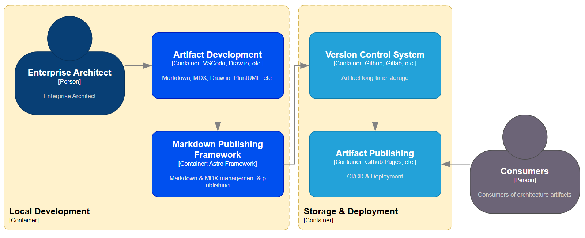

Основной вопрос при выборе репозитория: какие объекты вы собираетесь хранить в нем? 
Архитектурные артефакты (и не только их) можно разделить на две категории:
1. документы - диаграммы, описания, архитектурные решения и т.п.
2. реляционные записи - взаимосвязи компонентов, характеристики этих связей - то, что логично хранить в реляционных БД.

Коммерческие продукты, построенные с использованием различных БД, позволяют организовать учет связей объектов и их характеристик. Однако отсутствие таких продуктов не является стопером для создания Архитектурного репозитория.

## Проектируем репозиторий
Минималистский репозиторий, который мы хотим спроектировать, должен позволять выполнять наши задачи в соответствие с нашей методологией. В то же время он должен отвечать определенному набору требований, которые сделают нашу работу удобной, а наши артефакты - надежными и долгоживущими.

Сформулируем наши требования к репозиторию в виде архитектурных принципов:
- самодостаточность артефактов - архитектурные артефакты не должны зависеть от прикладных систем их ведения, фреймворков разработки и технологий
- local first - мы хотим работать в любое время и в любом месте - на работе, дома и даже в отпуске
- version control - отслеживание изменений и возможность отката - необходимый минимум для уверенной работы
- easy to develop & support - мы хотим сами развивать и сопровождать свой репозиторий
- open source software & no-cost deployment options - существенные затраты противоречат нашей идеологии  минималистского репозитория.

С учетом наших требований, мы вряд ли сможем позволить себе использовать реляционную БД. Это, соответственно, сузит функциональность нашего репозитория - подробнее см.Раздел 4. 
Тем не менее, мы сможем начать выполнять наши архитектурные обязанности и сможем обеспечить архитектурный процесс в его минималистской форме.

- architecture is code - мы будем относится к архитектурным артефактам, как к коду - вести их в системе контроля версий и пересобирать финальный репозиторий по мере их обновления.

Наш технологический стек:
- VS Code - можно использовать аналоги, но зачем?
- Git + Github - или их аналоги
- Astro - web framework 

Ввиду того, что мы выбрали подход "минимально-жизнеспособной архитектуры", то мы не будем использовать коммерческие продукты и Wiki-платформы, а создадим Архитектурный репозиторий сами.
Большое преимущество файлового хранилища - возможность использования системы контроля изменений - Git, GitLab и аналогичных. Эти инструменты позволяют архитекторам работать с архитектурными артефактами также, как программисты работают с кодом.

Собственно, использование Git и позволяет превратить текстовую БД с картинками в кодовую БД.
Сами артефакты также должны быть удобны для версионного контроля, а также для полно-текстового анализа.
Для текстовых описаний мы будем использовать Markdown-формат. 

Markdown-формат позволяет в том числе организовать подход local-first, когда все артефакты хранятся локально, а синхронизация обеспечивается системой версионного контроля (git).
Git также обеспечивает обмен информацией между авторами репозитария и публикацию информации - для пользователей (читателей).

Общая схема решения представлена на диаграмме:

Markdown-формат может подойти и для диаграмм - см.PlantUML и Mermaid. Если основные потребители архитектурных артефактов программисты и разработчики, то лаконичные диаграммы PlantUML вполне подойдут. Если же основные потребители - бизнес-пользователи, то намного нагляднее и понятнее будет рисовать диаграммы в Draw.io с использованием всех доступных в нем возможностей визуализации. 

## Разрабатываем репозиторий
Получившийся репозиторий можно найти в [Minimal EA Repo](https://github.com/archinomicon/ea-repo)